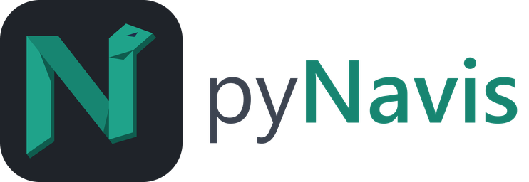
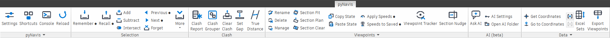

<p align="center">
  
</p>

# pyNavis

Python scripting and a folder-driven ribbon for Autodesk Navisworks Manage.

Drop a folder with a `script.py` and an icon into an extension, press Reload, and it is a
ribbon button. No compiling, no restart, no plugin boilerplate. If you have used
[pyRevit](https://github.com/pyrevitlabs/pyRevit), the layout will feel familiar: pyNavis
brings the same idea to Navisworks.

> pyNavis is an independent project and is not affiliated with or endorsed by Autodesk.

<p align="center">
  
</p>

## What you get

- **A ribbon built from folders.** `*.pushbutton`, `*.stack`, `*.pulldown`, `*.splitbutton`,
  `*.toggle`, `*.smartbutton`, `*.urlbutton`, `*.linkbutton`, `*.slideout` and more. Rename a
  folder and the button renames; list the folders in a `layout:` and they reorder.
- **Two Python engines.** IronPython 3.4 ships with pyNavis and is the default. Set
  `engine: cpython` in `bundle.yaml` to run a script on your installed CPython when you need numpy, pandas or any other compiled package.
- **Live reload.** Edit a script, click the button again. Add a bundle, press Reload.
- **Dock panels.** A `*.dockpane` bundle turns a `pane.xaml` plus an optional `script.py` into
  a native Navisworks dockable window.
- **Hooks and startup scripts.** `hooks\selection-changed.py` and 13 other Navisworks events
  run with no click; `startup.py` runs at boot and on every Reload.
- **Keyboard shortcuts and keytips** declared per bundle, with an in-app editor for overrides.
- **Context rules.** `context: selection & clash-tests` greys a button out until it can work.
- **The `pynavis` library.** Forms and pickers, toasts, a rich HTML output window with tables
  and charts, per-tool settings, Excel read and write, and Navisworks helpers for selection
  sets, properties, clash tests, viewpoints, sectioning and exports.
- **Light and dark themes** that follow Navisworks, with a full icon set for both.
- **Ask AI (beta).** A chat panel that writes a tool from a plain-words request, using your
  own Anthropic or OpenAI-compatible key, and revises it when you ask. Or copy the same
  authoring guide into any assistant you already use.

## Bundled tools

One tab, `pyNavis`, with six panels: pyNavis, Selection, Clash, Viewpoints, AI (beta) and Data. Full detail for every tool, including what each one
needs and what Shift+Click does, with screenshots, is at [tools.pynavis.com](https://tools.pynavis.com).

**pyNavis**

- **Settings**: theme, ribbon hints, extension folders and engine paths
- **Shortcuts**: view and rebind every keyboard chord
- **Hide Tabs**: take the tabs you choose off the ribbon, add-in tabs included, and put them back with the next click
- **Console**: an interactive Python console inside Navisworks
- **Reload**: rescan the extension folders and rebuild the ribbon, no restart
- **Panel slots** (flyout): generate dock panel slots beyond the five that ship

**Selection** (undo for selections: one register per document, kept on disk)

- **Remember**: store the current selection
- **Recall**: select whatever is in memory
- **Add**: add the selection to memory
- **Subtract**: remove the selection from memory
- **Intersect**: keep only what is both in memory and selected
- **Previous** / **Next**: select and zoom to one remembered item at a time, wrapping
- **Forget**: empty the memory for this document
- **More** menu: **Show Contents** lists the memory in the output window, one link per item
- **Save as Set**: promote the memory to a Navisworks selection set
- **Purge**: delete the stored memory files for every document

**Clash**

- **Clash Report**: result counts by status for every clash test, with CSV export
- **Clash Grouper**: group clash results into issues, with a live preview
- **Clear Clash**: point at two faces and type the gap to leave; the object slides the exact difference, tighter or apart, clash or no clash, and reports how far, ready for the authoring tool
- **True Distance**: true perpendicular distance between the two measured faces, on a bar across the bottom of the window

**Viewpoints**

- **Rename**: batch rename saved viewpoints with a live preview
- **Delete**: find viewpoints by search, type, duplicate name or comments, and delete them together
- **Manage**: sort, move, create folders and purge empty ones
- **Section Fit**: fit the six section planes to the selection, square to the objects
- **Section Plan**: fit the planes, then look straight down at them
- **Copy State**: copy section state, hidden items or appearance overrides
- **Paste State**: paste back what was copied for this document
- **Apply Speeds**: push your walk speed, turn speed and field of view at the view
- **Speeds to Saved**: write the same three into saved viewpoints you pick
- **Viewpoint Tracker**: a dock panel naming the view you are looking through
- **Section Nudge**: a dock panel remote for the section box, faces named the way you see them and moves that follow the screen, plus Ctrl+Alt chords
- **Tracker Window** (flyout): the same two lines in a floating window


**AI (beta)**

- **Ask AI**: a dock panel chat that writes a pyNavis tool from your request, creates it on an AI tab, and revises it; needs your own API key or a local OpenAI-compatible server
- **AI Settings**: provider, endpoint, model and key, stored encrypted outside `config.json`
- **Open AI Folder**: the `AI.extension` folder the generated tools live in

**Data**

- **Get Coordinates**: click a point and copy its coordinates to the clipboard
- **Go to Coordinates**: move the view to a point and mark it with a cross
- **Select by IDs**: select elements by Revit element ID, in a federated model
- **IDs of Selection**: copy the Revit element IDs of the selection to the clipboard
- **Excel Sets**: export selection sets to a workbook, or import them back
- **Export Viewpoints**: every saved viewpoint to CSV, with camera positions
- **Element ID Settings** (flyout): the settings both element ID tools share

## Requirements

- Windows with Autodesk Navisworks Manage 2023, 2024, 2025, 2026 or 2027
- [.NET SDK](https://dotnet.microsoft.com/download) 9.0.200 or later, only to build from source, because the solution uses the `.slnx` format (pyNavis itself targets .NET Framework 4.8)
- Optional: a 64-bit CPython install supported by Python.NET 3.0 (3.7 through 3.13), only for bundles that declare `engine: cpython`

## Install

Download the setup program from the
[releases page](https://github.com/pynavis/pyNavis/releases) and run it. It installs for the
current user only, so there is no administrator prompt, and it covers every supported
Navisworks release in one pass. Close Navisworks first: setup refuses to run while it is
open. Remove pyNavis later from **Apps and features**; your `config.json`, your logs and any
extension folders you made are left where they are.

Setup writes into your own profile:

| What | Where |
| --- | --- |
| Loader, one folder per Navisworks year | `%APPDATA%\Autodesk\ApplicationPlugins\pyNavis.bundle\Contents\<year>\` |
| Runtime, stdlib and the `pynavis` library | `%APPDATA%\pyNavis\<year>\runtime\` |
| The shipped extension | `%APPDATA%\pyNavis\extensions\pyNavis.extension\` |
| Settings and logs | `%APPDATA%\pyNavis\` |

`PackageContents.xml` in the bundle root tells Navisworks which `Contents\<year>` folder to
load, so one bundle serves every release you have installed.

Start Navisworks and look for the **pyNavis** tab.

### Updating

From 1.2.0 on, pyNavis checks GitHub for a newer release once a day, in the background and
with one anonymous request. It downloads the setup program, keeps it only when its SHA-256
matches the release's, and installs it quietly when you close Navisworks. **Settings >
Updates** has Check now, Skip this version and switches for both, and running a newer setup
program yourself works the same way.

An update keeps your `config.json`, your logs and every extension of your own. It replaces
`pyNavis.extension` whole, so keep your own tools out of it: put them in
`%APPDATA%\pyNavis\extensions\My pyNavis.extension`, where a `pyNavis.tab` or a
`Clash.panel` of the same name joins the pyNavis one on the ribbon. If you did change
`pyNavis.extension`, setup copies your changes to `%APPDATA%\pyNavis\backups` first and moves
the buttons and panels you added into `My pyNavis.extension`.

pyNavis is provided as is, under the [Apache License 2.0](LICENSE), with no warranty. Setup shows the licence before it installs; if you build and install from source instead, the same terms apply.

## Build from source

pyNavis compiles against the Navisworks API assemblies, which are Autodesk's and cannot be
redistributed, so they are not in this repository. If Navisworks Manage is installed, the
build finds them on its own. Otherwise see [refs/README.md](refs/README.md) for where to
place them.

```powershell
git clone https://github.com/pynavis/pyNavis.git
cd pyNavis

# Build for your Navisworks release (defaults to 2026)
dotnet build -c Release -p:NavisVersion=2026

# Install for every detected Navisworks release that has a build. Close Navisworks first.
# This writes the same per-user bundle the setup program does, so no elevation is needed.
powershell -ExecutionPolicy Bypass -File tools\install.ps1
```

To work on pyNavis itself, use `tools\deploy-dev.ps1` instead: it installs the loader the
same way but points `config.json` at the repository's `bin` folder, so a rebuild is picked up
by the next Navisworks start without reinstalling anything.

Run the tests with `dotnet test`.

### Releasing

Versions are `MAJOR.MINOR.PATCH`: PATCH for fixes, MINOR for anything new (a tool, a
`bundle.yaml` or `config.json` key, a `pynavis` function, a Navisworks year), MAJOR when
something existing changes meaning or goes away. The one source is `__version__` in
`pynavislib/pynavis/__init__.py`; the build stamps it into every assembly, the installer
name, the Autodesk manifest, the Settings window and the docs. To cut a release:

1. Set `__version__` and add the `## [x.y.z] - yyyy-mm-dd` entry at the top of
   [CHANGELOG.md](CHANGELOG.md). The tests and `tools\package.ps1` refuse a mismatch.
2. Rebuild the generated docs: `python tools\build_docs.py` and `python tools\build_tools_site.py`.
3. `dotnet test`, then `powershell -ExecutionPolicy Bypass -File tools\package.ps1` with
   Navisworks closed. It writes
   `dist\pyNavis-x.y.z-setup.exe`, and `tools\installer\manifests\x.y.z.txt`, the list of
   files this release ships, which every later installer needs to tell users' own work from
   pyNavis's: commit it with the release.
4. Commit as `Release x.y.z`, tag it `vx.y.z`, push, and publish a GitHub release with the
   setup program attached and the changelog entry as its notes. The update check reads the
   latest release and verifies the download against the SHA-256 GitHub records for it.

## Write your first button

```
MyTools.extension\
  MyTools.tab\
    Demo.panel\
      Hello.pushbutton\
        script.py
        bundle.yaml      (optional)
        icon.png         (optional)
```

```python
# script.py
"""Counts the items in the current selection."""
from pynavis import selection, toast

items = selection.get_items()

if items:
    toast.success('%d item(s) selected' % len(items))
else:
    toast.info('Nothing selected', 'Pick something in the model and run this again.')
```

Add the folder that holds `MyTools.extension` to the `"extensions"` array in
`%APPDATA%\pyNavis\config.json`, press **Reload**, and click.
Shift+Click runs the bundle's `config.py` if it has one; Alt+Click opens the bundle folder.

The full authoring guide is at [docs.pynavis.com](https://docs.pynavis.com). Start with Quickstart,
then Anatomy of an extension and the API reference. The same pages live in `docs/authoring`
and work straight from disk: open `index.html` in a browser.

## Repository layout

| Path | What it is |
|---|---|
| `src/PyNavis` | The thin loader plugin Navisworks discovers |
| `src/PyNavis.Runtime` | Bundle parser, ribbon builder, script engines, forms, output window |
| `src/PyNavis.Cli`, `src/PyNavis.Tests` | Command-line helper and the test suite |
| `pynavislib/pynavis` | The Python library scripts import |
| `extensions/` | The shipped pyNavis extension |
| `tests/fixtures` | A Smoke extension of worked examples covering every bundle kind (not installed; see its README) |
| `docs/authoring` | The tool-authoring guide, published at docs.pynavis.com (generated by `tools/build_docs.py`) |
| `docs/tools` | The tools guide, published at tools.pynavis.com (generated by `tools/build_tools_site.py`) |
| `site/` | The homepage at pynavis.com, a single static page |
| `tools/` | Installer, dev deploy script, icon, logo and docs generators |

## Acknowledgements

pyNavis owes its core idea, its bundle folder conventions and the shape of parts of its
scripting API to [pyRevit](https://github.com/pyrevitlabs/pyRevit) by Ehsan Iran-Nejad and
contributors. pyNavis is an independent implementation and contains no pyRevit source code.

It is built on [IronPython](https://ironpython.net/) and
[Python.NET](https://github.com/pythonnet/pythonnet).

## Licence

[Apache License 2.0](LICENSE). See [NOTICE](NOTICE) for attributions.

Autodesk and Navisworks are registered trademarks of Autodesk, Inc.
